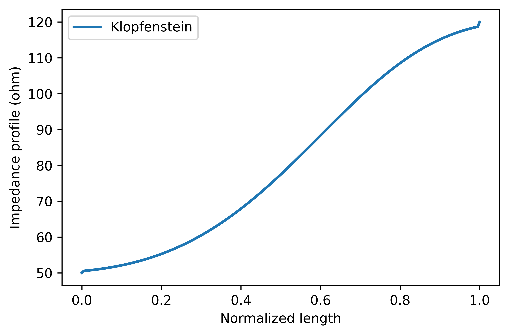
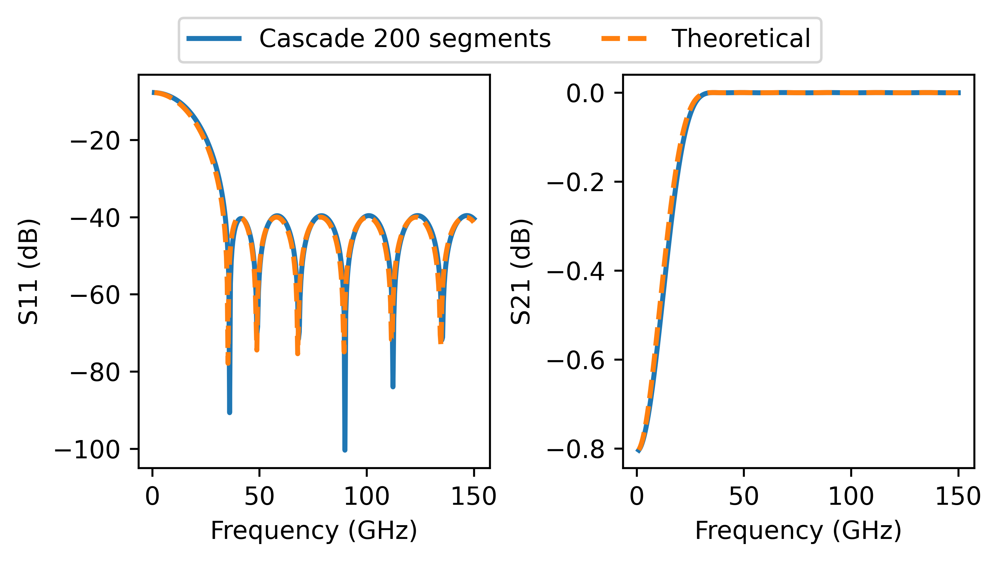
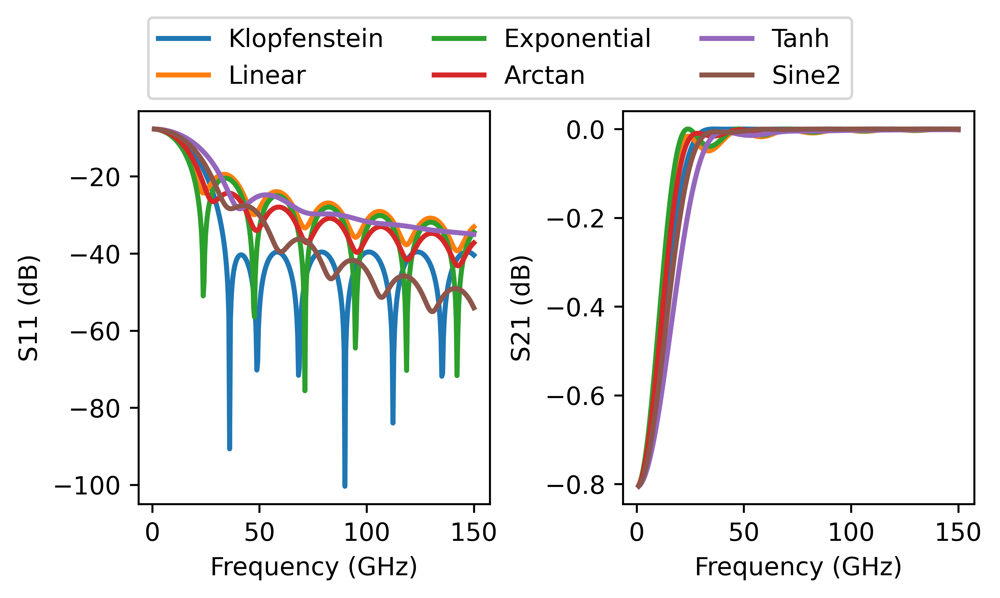

# Klopfenstein Taper

Python implementation of the Klopfenstein taper based on [1]-[3]. A beginner-friendly explanation of the Klopfenstein taper can be found in [4]. For now, I only provide you with the functions to obtain the impedance profile with respect to length. To actually map the impedance profile to a transmission line type, see the discussion in the last section below.

## Code requirements

I kept it simple. For the taper itself, you just need `numpy`, and for the plots `matplotlib`. You can install both with following command:

```powershell
python -m pip install -U numpy matplotlib
```

## Example of 50ohm to 120ohm taper

Please see the python script for full details of the defined functions.

```python
Z1 = 50  # start impedance
Z2 = 120 # end impedance
N  = 200 # number of segments 
# the more segments, the better. However, computing S-parameters get slower via matrix cascade method.
Gmax = db2mag(-40) # max reflection in passband
# Gmax must be lower than (Z2-Z1)/(Z2+Z1), otherwise you are introducing gain in S11. I will let you think about that!
Zklopf = klopf(Z1, Z2, Gmax, N)  # Klopfenstein impedance profile
```



Since the Klopfenstein taper is based Tchebycheff filter, the S-parameters can be computed using the theoretical response of a Tchebycheff filter (see [1]). However, a general method to get the S-parameters is with cascading finite segments across the length of the taper. This method can be used for any impedance profile (see the corresponding section below for examples).

```python
M = 400  # number of frequency points
f = np.linspace(1,150,M)*1e9 # in Hz
L = 4e-3 # in meter
ereff = 2.5 - 0j
Sklopf_the = klopf_S(Z1, Z2, Gmax, L, f, ereff=ereff)  # Theoretical response
Sklopf_cas = taperS(Zklopf, L, f, ereff=ereff)         # Actual response of cascade of finite segments
```



## Computing the 3dB cut-off frequency and minimum taper length

What makes Klopfenstein taper so useful is the fact it is based on Tchebycheff filter, to which we know its frequency response (see [1]). Therefore, we can reverse calculate the required taper length from the 3dB cut-off frequency and vice versa. 

```python
# compute required minimum taper length for a given 3dB cut-off frequency
L = klopf_f2L(Z1, Z2, Gmax, f3db, ereff)

# compute the 3dB cut-off frequency for a given taper length
f3db = klopf_L2f(Z1, Z2, Gmax, L, ereff)
```

## Comparison with other tapers

It is always fun to experiment with other impedance profiles. Your typical textbook will probably only mention linear and exponential impedance profiles, but you can be creative and define your own impedance profiles. Just make sure you start with Z1 and end with Z2.

```python
x = np.linspace(0,1,N) # normlized length
# impedance profiles
Zlin  = (Z2-Z1)*x + Z1    # linear
Zexp  = Z1*(Z2/Z1)**x     # exponential
Zatan = (Z2-Z1)*np.arctan(x/(1-x*0.999))*2/np.pi + Z1  # arctan  (the 0.999 is to avoid dividing by zero)
Ztanh = (Z2-Z1)*np.tanh(x/(1-x*0.999)) + Z1            # tanh
```


```python
# frequency response
Slin  = taperS(Zlin,  L, f, ereff=ereff)
Sexp  = taperS(Zexp,  L, f, ereff=ereff)
Satan = taperS(Zatan, L, f, ereff=ereff)
Stanh = taperS(Ztanh, L, f, ereff=ereff)
```



## Remarks on the Klopfenstein taper

Whenever I read about Klopfenstein taper from other authors, I always get the feeling that Klopfenstein taper is the best taper you can design. However, that is not entirely true. The “optimality” of Klopfenstein taper comes from the optimality of the standard Tchebycheff filter, which is optimal in the sense of minimizing the maximum ripple in the passband for a desired maximum ripple. However, if you care more about the cut-off frequency, you can design other impedance profiles that give lower cut-off frequency for the same taper length. Of course, the ripple in the passband would be different, but that is up to your specification. In theory, if you follow the same procedure Klopfenstein took in deriving his taper, you can stop at the point where he decided to use Tchebycheff response, and put your own high-pass filter response. Though, you might not get a nice equation for the impedance profile.

Lastly, this is often forgotten, but the Klopfenstein taper is strictly defined for true TEM propagation. This means lossless and dispersion-free medium. Such conditions are never achieved in practice (unless you are working with superconductors). For typical transmission line types with relatively low losses, the Klopfenstein taper should be fine, but expect things to look differently if you try applying such taper in very lossy materials.

## Map the impedance profile to geometric values

This is the trickiest part of designing a taper for a transmission line. It is quite easy to define an impedance profile, which could be anything as discussed in the taper comparison example above. If your transmission line has only one geometric parameter to vary, then you could reverse calculate that value from the impedance profile. For example, the trace width of a microstrip line. You can find quasi-static models in [5]. You can also check [6] for equations for other transmission line types.

The problem get more complicated when you have to vary more than one geometric parameter. For example, in coplanar waveguide (CPW) you can vary the width of the signal line as well as the spacing to the ground planes. To be honest, I’m not aware of a simple solution. The best I can think of is to define one parameter yourself and compute the other from the impedance profile. If someone knows about a better solution, please let me know. I will update this repo if I have better idea on this topic.

## References

- [1] R. W. Klopfenstein, "A Transmission Line Taper of Improved Design," in Proceedings of the IRE, vol. 44, no. 1, pp. 31-35, Jan. 1956, doi: 10.1109/JRPROC.1956.274847.
    
    [A Transmission Line Taper of Improved Design](https://ieeexplore.ieee.org/document/4051841)
    
- [2] D. Kajfez and J. O. Prewitt, "Correction to "A Transmission Line Taper of Improved Design" (Letters)," in IEEE Transactions on Microwave Theory and Techniques, vol. 21, no. 5, pp. 364-364, May 1973, doi: 10.1109/TMTT.1973.1128003.
    
    [Correction to "A Transmission Line Taper of Improved Design" (Letters)](https://ieeexplore.ieee.org/document/1128003)
    
- [3] M. A. Grossberg, "Extremely rapid computation of the Klopfenstein impedance taper," in Proceedings of the IEEE, vol. 56, no. 9, pp. 1629-1630, Sept. 1968, doi: 10.1109/PROC.1968.6686.
    
    [Extremely rapid computation of the Klopfenstein impedance taper](https://ieeexplore.ieee.org/document/1448616)
    
- [4] Michael Steer, Microwave and RF Design: Networks. Volume 3. (Third Edition), NC State University, 2019. doi: 10.5149/9781469656953_Steer
    
    [Microwave and RF Design: Networks](https://doi.org/10.5149/9781469656953_Steer)
    
- [5] Michael Steer, Microwave and RF Design: Transmission Lines. Volume 2. (Third Edition), NC State University, 2019. doi: 10.5149/9781469656939_Steer
    
    [Microwave and RF Design: Transmission Lines](https://doi.org/10.5149/9781469656939_Steer)
    
- [6] B. Wadell, Transmission Line Design Handbook, ser. Artech House Microwave Library. Artech House, 1991. ISBN: 9780890064368
    
    [Transmission Line Design Handbook](https://uk.artechhouse.com/Transmission-Line-Design-Handbook-P684.aspx)
