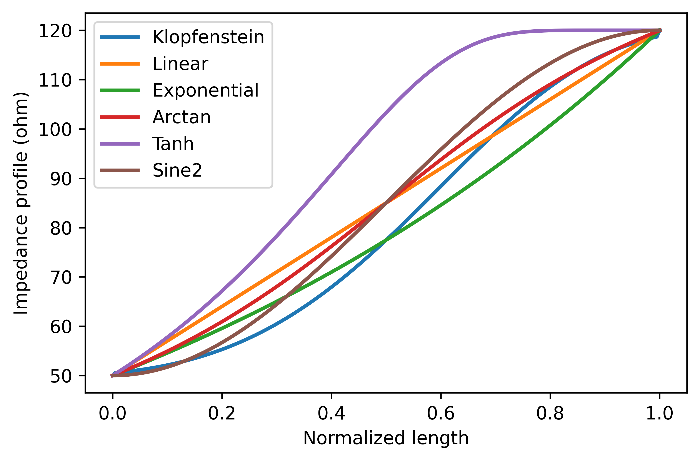

# Klopfenstein Taper

Python implementation of the Klopfenstein taper based on references [1]-[3]. A beginner-friendly explanation of the Klopfenstein taper can be found in [4]. Currently, this repository provides functions to calculate the impedance profile along the taper length. For mapping the impedance profile to specific transmission line geometries, please refer to the discussion in the last section below.

## Code requirements

I kept it simple. For the taper itself, you just need `numpy`, and for the plots `matplotlib`. You can install both with following command:

```powershell
python -m pip install -U numpy matplotlib
```

## Example of 50ohm to 120ohm taper

Please see the python script for full details of the defined functions.

```python
Z1 = 50  # start impedance
Z2 = 120 # end impedance
N  = 200 # number of segments 
# the more segments, the better. However, computing S-parameters get slower via matrix cascade method.
Gmax = db2mag(-40) # max reflection in passband
# Gmax must be lower than (Z2-Z1)/(Z2+Z1), otherwise you are introducing gain in S11. I will let you think about that!
Zklopf = klopf(Z1, Z2, Gmax, N)  # Klopfenstein impedance profile
```


Since the Klopfenstein taper is based Tchebycheff filter, the S-parameters can be computed using the theoretical response of a Tchebycheff filter (see [1]). However, a general method to get the S-parameters is by cascading finite segments across the length of the taper. This method can be used for any impedance profile (see the section below for examples).

```python
M = 400  # number of frequency points
f = np.linspace(1,150,M)*1e9 # in Hz
L = 4e-3 # in meter
ereff = 2.5 - 0j
Sklopf_the = klopf_S(Z1, Z2, Gmax, L, f, ereff=ereff)  # Theoretical response
Sklopf_cas = taperS(Zklopf, L, f, ereff=ereff)         # Actual response of cascade of finite segments
```


## Computing the 3dB cut-off frequency and minimum taper length

What makes Klopfenstein taper so useful is the fact it is based on Tchebycheff filter, to which we know its frequency response (see [1]). Therefore, we can reverse calculate the required taper length from the 3dB cut-off frequency and vice versa. 

```python
# compute required minimum taper length for a given 3dB cut-off frequency
L = klopf_f2L(Z1, Z2, Gmax, f3db, ereff)

# compute the 3dB cut-off frequency for a given taper length
f3db = klopf_L2f(Z1, Z2, Gmax, L, ereff)
```

## Comparison with other tapers

It is always fun to experiment with other impedance profiles. Your typical textbook will probably only mention linear and exponential impedance profiles, but you can be creative and define your own impedance profiles. Just make sure you start with Z1 and end with Z2. On the other hand, you can be super creative and create impedance profiles that are not monotonically increasing (or decreasing). Try creating a profile oscillating between Z1 and Z2 and see what happens. Who knows you might discover filtering ;)

```python
x = np.linspace(0,1,N) # normlized length
# impedance profiles
Zlin  = (Z2-Z1)*x + Z1    # linear
Zexp  = Z1*(Z2/Z1)**x     # exponential
Zatan = (Z2-Z1)*np.arctan(x/(1-x*0.999))*2/np.pi + Z1  # arctan (the 0.999 is to avoid dividing by zero)
Ztanh = (Z2-Z1)*np.tanh(x/(1-x*0.999)) + Z1            # tanh
Zsin2 = Z1+(Z2-Z1)*np.sin(np.pi/2*x)**2   # sine^2 (try changing the period and see what happens)
```



```python
# frequency response
Slin  = taperS(Zlin,  L, f, ereff=ereff)
Sexp  = taperS(Zexp,  L, f, ereff=ereff)
Satan = taperS(Zatan, L, f, ereff=ereff)
Stanh = taperS(Ztanh, L, f, ereff=ereff)
Ssin2 = taperS(Zsin2, L, f, ereff=ereff)
```


## Remarks on the Klopfenstein Taper

While many authors present the Klopfenstein taper as the ultimate taper design, this requires some clarification. The taper's "optimality" derives from the standard Chebyshev filter, which minimizes the maximum ripple in the passband for a specified maximum ripple value. However, if your primary concern is the cut-off frequency, other impedance profiles can achieve lower cut-off frequencies for the same taper length, albeit with different passband ripple characteristics.

Theoretically, you could follow Klopfenstein's derivation process but deviate at the point where he chose the Chebyshev response, substituting your own high-pass filter response instead. This might not yield such elegant equations for the impedance profile, but it could better suit your specific requirements.

An important consideration often overlooked is that the Klopfenstein taper is strictly defined for true TEM propagation, which assumes both lossless and dispersion-free medium. These ideal conditions are practically unattainable except with superconductors. For typical transmission lines with moderate losses, the Klopfenstein taper performs adequately, but expect performance deviation when implementing such tapers in highly lossy materials.

## Map the impedance profile to geometric values

This is the most challenging aspect of taper design for transmission lines. While defining an impedance profile is straightforward (as shown in the comparison examples above), mapping it to physical dimensions requires careful consideration.

For transmission lines with a single variable parameter (like microstrip trace width), you can calculate the dimension directly from the impedance profile using quasi-static models found in [5]. Additional equations for various transmission line types are available in [6].

The challenge increases significantly with multiple geometric parameters. For instance, coplanar waveguides (CPW) involve both signal line width and ground plane spacing. To be honest, I’m not aware of a simple solution. The best I can think of is to define one parameter yourself and compute the other from the impedance profile. If someone knows about a better solution, please let me know. I will update this repo if I have better idea on this topic.

## References
[1] R. W. Klopfenstein, "A Transmission Line Taper of Improved Design," in Proceedings of the IRE, vol. 44, no. 1, pp. 31-35, Jan. 1956, [doi: 10.1109/JRPROC.1956.274847](https://doi.org/10.1109/JRPROC.1956.274847).
    
[2] D. Kajfez and J. O. Prewitt, "Correction to "A Transmission Line Taper of Improved Design" (Letters)," in IEEE Transactions on Microwave Theory and Techniques, vol. 21, no. 5, pp. 364-364, May 1973, [doi: 10.1109/TMTT.1973.1128003](https://doi.org/10.1109/TMTT.1973.1128003).
    
[3] M. A. Grossberg, "Extremely rapid computation of the Klopfenstein impedance taper," in Proceedings of the IEEE, vol. 56, no. 9, pp. 1629-1630, Sept. 1968, [doi: 10.1109/PROC.1968.6686](https://doi.org/10.1109/PROC.1968.6686).
    
[4] Michael Steer, Microwave and RF Design: Networks. Volume 3. (Third Edition), NC State University, 2019. [doi: 10.5149/9781469656953_Steer](https://doi.org/10.5149/9781469656953_Steer)
    
[5] Michael Steer, Microwave and RF Design: Transmission Lines. Volume 2. (Third Edition), NC State University, 2019. [doi: 10.5149/9781469656939_Steer](https://doi.org/10.5149/9781469656939_Steer)

[6] B. Wadell, Transmission Line Design Handbook, ser. Artech House Microwave Library. Artech House, 1991. ISBN: 9780890064368